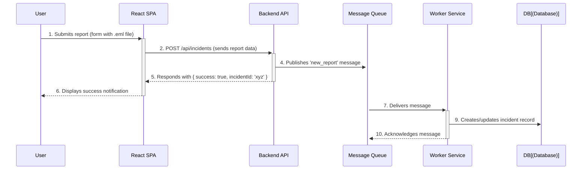

# Project Diagrams

This document contains all the key diagrams for the GUARDBULLDOG system, presented in two formats:
1.  **ASCII Art**: Simple text-based visuals for easy screenshotting.
2.  **Mermaid Code**: Detailed code that can be used in a Mermaid editor to generate high-quality images.

---

## 1. Use Case Diagram

### ASCII Version

```
===================================
    GUARDBULLDOG Use Case Diagram
===================================

+------------------------------------+
|           USER ACTIONS             |
+------------------------------------+
|   (User) ---> [Register Account]   |
|   (User) ---> [Login]              |
|   (User) ---> [Report Phishing]    |
|   (User) ---> [Complete Module]    |
+------------------------------------+

+------------------------------------+
|           ADMIN ACTIONS            |
+------------------------------------+
|   (Admin) --> [Review Incident]    |
|   (Admin) --> [Manage Content]     |
|   (Admin) --> [View Analytics]     |
+------------------------------------+
```

### Mermaid Code Version

```mermaid
use case "GUARDBULLDOG System" {
    actor User
    actor Admin

    Admin --|> User

    User -> (Register Account)
    User -> (Login)
    User -> (Complete Awareness Module)
    User -> (Report Phishing Email)

    (Complete Awareness Module) .> (Login) : <<includes>>
    (Report Phishing Email) .> (Login) : <<includes>>

    Admin -> (Review & Triage Incident)
    Admin -> (Manage Educational Content)
    Admin -> (View Analytics Dashboard)
}
```

---

## 2. Sequence Diagram: Report a Phishing Email

### ASCII Version

```
  User          React SPA       Backend API      Message Queue     Worker Service
   |                |                 |                 |                 |
   |--Submit Report->|                 |                 |                 |
   |                |--POST /incidents->|                 |                 |
   |                |                 |--Publish Msg--->|                 |
   |                |                 |<--Success 200---|                 |
   |<--Show Success--|                 |                 |                 |
   |                |                 |                 |--Deliver Msg--->| 
   |                |                 |                 |                 |--Process...
   |                |                 |                 |                 |--Save to DB
   |                |                 |                 |                 |--Ack Msg
   |                |                 |                 |<----------------|
```

### Mermaid Code Version



---

## 3. Sequence Diagram: User Authentication

### ASCII Version

```
  User          React SPA       Backend API         Database
   |                |                 |                 |
   |--Enter Credentials->|                 |                 |
   |                |--POST /login----->|                 |
   |                |                 |--Find User------>| 
   |                |                 |<--User Record----| 
   |                |                 |--Verify Passwd--| 
   |                |<--Token----------|                 |
   |--Redirect------|                 |                 |
```

### Mermaid Code Version

```mermaid
sequenceDiagram
    participant User
    participant FE as React SPA
    participant API as Backend API
    participant DB as Database

    User->>+FE: 1. Enters credentials (email, password)
    FE->>+API: 2. POST /api/auth/login
    API->>+DB: 3. Finds user by email
    DB-->>-API: 4. Returns user record (with hashed password)
    API->>API: 5. Compares provided password with hash
    alt Credentials are valid
        API->>API: 6a. Generates JWT
        API-->>-FE: 7a. Responds with { token: 'jwt_token' }
    else Credentials are invalid
        API-->>-FE: 6b. Responds with 401 Unauthorized
    end
```
