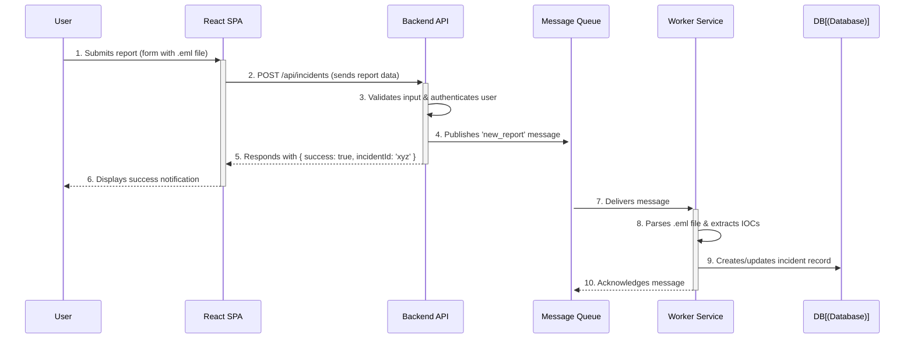

# Sequence Diagrams

This document contains sequence diagrams that illustrate the step-by-step interactions for key use cases within the GUARDBULLDOG system.

## 1. Report a Phishing Email

This diagram shows the flow of events when a user reports a suspicious email.



### Flow Description:

1.  **User to Frontend**: The user fills out the report form in the React application and submits it.
2.  **Frontend to API**: The frontend sends a `POST` request to the backend API with the report details, including the attached file.
3.  **API Internal**: The API validates the data and confirms the user is authenticated.
4.  **API to Message Queue**: The API immediately publishes a message to a queue (like RabbitMQ or SQS). This decouples the time-consuming processing from the user's request, ensuring a fast response.
5.  **API to Frontend**: The API sends a success response back to the frontend, confirming the report was received.
6.  **Frontend to User**: The UI displays a success message to the user.
7.  **Message Queue to Worker**: The message queue delivers the task to a background worker service.
8.  **Worker Internal**: The worker service performs the heavy lifting: parsing the email file, scanning for threats, and extracting Indicators of Compromise (IOCs).
9.  **Worker to Database**: The worker saves the detailed analysis results to the database, updating the incident record.
10. **Worker to Message Queue**: The worker acknowledges that the message has been successfully processed.

---

## 2. User Authentication (Login)

This diagram illustrates the process of a user logging in and receiving a JSON Web Token (JWT).

```mermaid
sequenceDiagram
    participant User
    participant FE as React SPA
    participant API as Backend API
    participant DB as Database

    User->>+FE: 1. Enters credentials (email, password)
    FE->>+API: 2. POST /api/auth/login
    API->>+DB: 3. Finds user by email
    DB-->>-API: 4. Returns user record (with hashed password)
    API->>API: 5. Compares provided password with hash
    alt Credentials are valid
        API->>API: 6a. Generates JWT
        API-->>-FE: 7a. Responds with { token: 'jwt_token' }
        FE->>FE: 8a. Stores token (e.g., in localStorage)
        FE-->>-User: 9a. Redirects to dashboard
    else Credentials are invalid
        API-->>-FE: 6b. Responds with 401 Unauthorized
        FE-->>-User: 7b. Displays 'Invalid credentials' error
    end
```

### Flow Description:

1.  **User to Frontend**: The user submits their email and password through the login form.
2.  **Frontend to API**: The React app sends the credentials to the backend's login endpoint.
3.  **API to Database**: The API queries the database to find a user with the matching email address.
4.  **Database to API**: The database returns the user's data, including the securely hashed password.
5.  **API Internal**: The API uses a library like bcrypt to compare the plaintext password from the user with the stored hash.
6.  **Successful Authentication**:
    - **6a**: If the passwords match, the API generates a JWT, signing it with a secret key and including user details (like `userId` and `role`) in the payload.
    - **7a**: The API sends the JWT back to the client.
    - **8a**: The frontend stores the token securely for use in subsequent requests.
    - **9a**: The user is redirected to their protected dashboard.
7.  **Failed Authentication**:
    - **6b**: If the passwords do not match, the API returns a `401 Unauthorized` error.
    - **7b**: The frontend displays an appropriate error message to the user.
