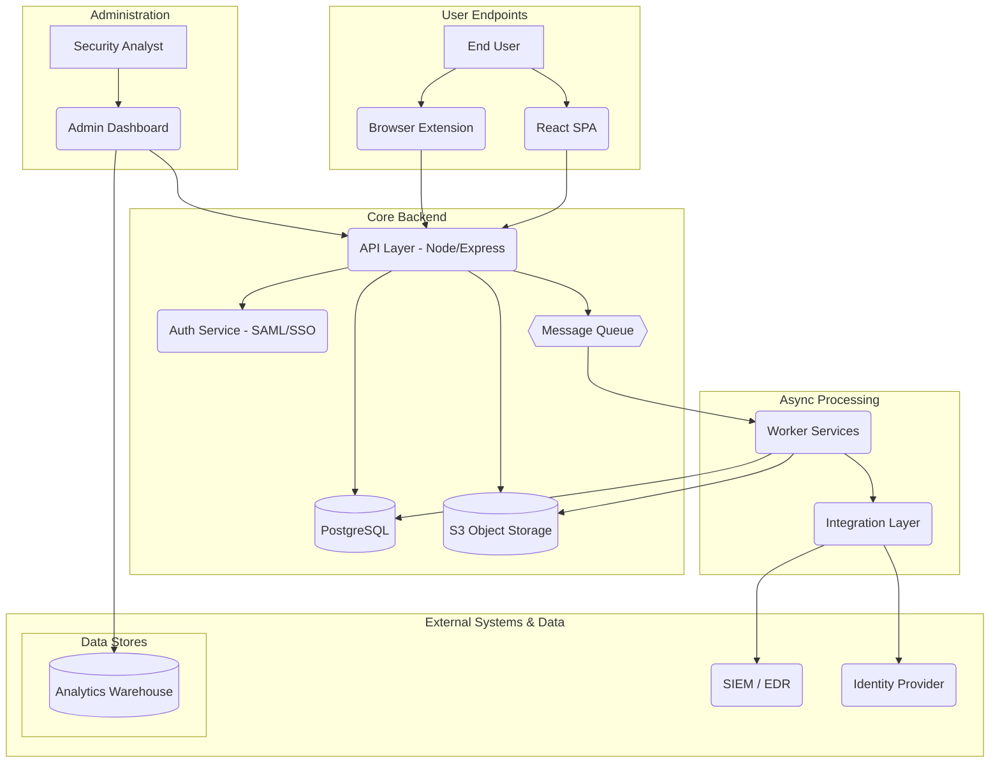

# System Architecture

This document outlines the high-level system architecture for the GUARDBULLDOG platform, designed for scalability, security, and maintainability.

## 1. High-Level Components

The architecture is composed of several decoupled services that communicate via APIs and a message queue.

*   **Frontend**
    *   A responsive Single-Page Application (SPA) built with **React (TypeScript)**.
    *   An optional **browser extension** for one-click reporting.

*   **API Layer (Backend)**
    *   A **Node.js/Express** RESTful API serving JSON to the frontend. This is the primary entry point for all client requests.

*   **Authentication Service**
    *   Handles all authentication logic, integrating with campus **SAML/OIDC** for SSO.
    *   Manages **OAuth2** for third-party API clients.

*   **Data Stores**
    *   **Relational DB (PostgreSQL)**: The primary database for storing structured data like users, incidents, and metadata.
    *   **Object Storage (S3 or equivalent)**: Used for storing unstructured data, primarily email attachments (`.eml`, `.pdf`, screenshots).
    *   **Analytics Store (Data Warehouse or ELK Stack)**: A dedicated database (like BigQuery, Redshift, or Elasticsearch) for storing and querying logs and analytics data.

*   **Message Queue (Asynchronous Processing)**
    *   A message broker like **RabbitMQ or AWS SQS** to decouple long-running tasks from the main API layer. This is used for parsing attachments, extracting Indicators of Compromise (IOCs), and sending alerts.

*   **Worker Services**
    *   A set of background services that consume messages from the queue to perform intensive tasks:
        *   Parsing and scanning attachments (e.g., with an antivirus engine).
        *   Extracting IOCs (domains, hashes, URLs).
        *   Calculating risk scores for new incidents.

*   **Integration Layer**
    *   A dedicated layer for managing connections to external systems, including SIEM/EDR, email gateways, ticketing systems (Jira), and the campus identity provider (Active Directory).

*   **Admin UI**
    *   A specialized interface for administrators, including the triage console and analytics dashboards (which can be built in-app or using tools like **Grafana**).

*   **Monitoring & Logging**
    *   **Prometheus & Grafana** for system metrics and performance monitoring.
    *   **ELK Stack (Elasticsearch, Logstash, Kibana)** for centralized logging.

## 1.1. Architecture Diagram

## 2. Security & Hosting

*   **Hosting**: The platform will be hosted on a campus-secured cloud environment (AWS/GCP) or in the campus data center.
*   **Network Security**: The architecture will employ network segmentation, a Web Application Firewall (WAF), and IP allowlists for sensitive admin endpoints.
*   **Compliance & Testing**: The system will undergo regular penetration tests and adhere to SOC2-like controls. All handling of student data will be aligned with FERPA regulations.
